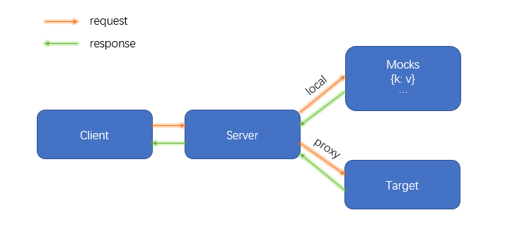

# birdmock

使用 nodejs 的原生 http/https 模块，结合 mockjs 开发的本地 mock 服务。

- 当客户端发起请求时，如果是请求本地的 mock 服务，mock 服务会搜集项目根目录下 `birdmock/mocks` 中所有的 js 文件，并将它们导出的 mock 数据注册到 mock 数据集中，然后用请求的接口地址去和 mock 数据集的键做匹配，如果匹配上了就将 mock 数据集中键对应的值作为响应数据响应给客户端；

- 当客户端需要将请求通过本地 mock 服务转发给其他服务时，本地 mock 服务会根据配置文件的 `proxy` 配置将请求转发给其他服务，然后将其他服务的响应结果响应给客户端；

<div align="center">
  
</div>

## 特性

- 不依赖 Webpack 等构建开发工具，可以独立在本地运行 http/https 服务；
- 支持自定义响应数据、静态资源获取、上传文件、跨域、https 请求和日志打印；
- 支持为 http/https 请求 mock 数据配置延迟响应时间；
- 支持通过 `rawResponse` 函数对外提供 nodejs 的请求和响应接口；
- 支持正向代理，即从本地启动的服务代理到目标服务；
- 支持配置其他开发工具的 proxy 代理到 birdmock 启动的服务；

<font color=green> P.s. mockjs 版本为 1.1.0，mock 数据支持 mockjs 的内置语法。</font>

## 安装

使用 npm 安装

```shell
npm i @bigbigbird/mock -D
```

使用 yarn 安装

```
yarn add @bigbigbird/mock -D
```

## 使用

### 启动默认的 mock 服务

修改 package.json 中的 `scripts` 配置。

```json
"scripts": {
  "mock": "birdmock"
}
```

执行上述命令

```bash
npm run mock
```

执行命令后，会根据默认配置启动 mock 服务，如果服务启动成功，则终端会打印如下内容。

```
=====代理模式已启动=====
{ /api => http://127.0.0.1:4201 }
```

并且在启动 mock 服务之前，会自动地在项目根目录生成 birdmock 文件夹，其目录结构如下。

```
 -birdmock
    -assets         # 静态资源目录
    -logs           # 日志目录
    -mocks          # mock文件目录
    -upload         # 文件上传目录
    -config.js      # birdmock配置文件
```

birdmock 的默认配置在 `birdmock/config.js` 中。

```js
'use strict';
module.exports = {
  // 修改 mock 文件时重启服务的防抖时间
  watchDebounceTime: 2000,
  // 日志是否格式化响应的json
  parseJSON: false,
  // 本地服务，协议设置为 https 则将开启 https 服务
  server: 'localhost:4201',
  // 可选代理服务（可通过server服务代理到目标服务）
  proxy: {
    '/api': {
      target: 'http://127.0.0.1:4201',
      changeOrigin: true,
      rewrite: function (url) {
        return url;
      },
    },
    '/ipa': {
      target: 'http://127.0.0.1:4202',
      changeOrigin: true,
      rewrite: function (url) {
        return url;
      },
    },
  },
  // 可选跨域配置
  cors: {
    // 源服务，默认值：'*'
    origin: '*',
    // 允许的请求头字段，默认值：'*'
    headers: '*',
    // 允许的请求方法，默认值：'*'
    methods: '*',
    // 是否允许跨域携带 cookie
    // 如果需要跨域携带 cookie ，则上述默认值不能设置为'*'
    credentials: 'false',
  },
};
```

### 启动简单的 mock 服务

默认启动的 mock 服务会将以 `/api` 开头的接口代理转发到自身，一般开发的时候不需要这么做，应该是代理到后端的服务地址，这里是为了兼容“可以代理到自身服务”的使用场景。所以，如果不需要代理和跨域请求，一个简单地配置应该是这样的。

```js
module.exports = {
  // 修改配置文件或 mock 文件时，重启 mock 服务的防抖时间
  watchDebounceTime: 2000,
  // 日志是否格式化响应的 json 数据
  parseJSON: false,
  // 本地服务地址，协议设置为 https 则将开启 https 服务
  server: 'http://localhost:4201',
};
```

修改 `birdmock/config.js` 或 `birdmock/mocks` 中的文件后，mock 服务会自动地进行重启，并在控制台打印类似如下内容。

```
服务器重启中...
=====本地模式已启动{/ => http://localhost:4201} { 接口数量:6 }=====
```

<font color=green>P.s. 配置 server 为 https 协议的时候，因为本地 mock 服务证书未颁发，故本地 https 请求会提示连接不安全，这个不影响本地开发使用。</font>

### 启动代理 mock 服务

在配置文件中加上 proxy 配置

```js
module.exports = {
  // 修改配置文件或 mock 文件时，重启 mock 服务的防抖时间
  watchDebounceTime: 2000,
  // 日志是否格式化响应的 json 数据
  parseJSON: false,
  // 本地服务地址，协议设置为 https 则将开启 https 服务
  server: 'http://localhost:4201',
  // 代理配置
  proxy: {
    '/api': {
      // 这里应修改为你实际要代理的目标服务地址
      target: 'http://127.0.0.1:4201',
      changeOrigin: true,
      rewrite: function (url) {
        return url;
      },
    },
    '/ipa': {
      // 这里应修改为你实际要代理的目标服务地址
      target: 'http://127.0.0.1:4202',
      changeOrigin: true,
      rewrite: function (url) {
        return url;
      },
    },
  },
};
```

还可以直接从命令行配置代理，但这种方式只能配置一个代理，没有使用配置文件灵活。在 package.json 的 `scripts` 中添加如下命令。

```json
"scripts": {
  "mock:proxy": "cross-env target=localhost:4202 pathRewrite='^/api':'/ipa' changeOrigin=true birdmock"
}
```

从命令行启动这个本地代理服务

```bash
npm run mock:proxy
```

<font color=green> P.s. 上述 `pathRewrite`表示会将接口匹配正则`^/api`的字符串替换为`/ipa`，这和配置文件中的`rewrite`配置不同，`rewrite` 函数会将请求接口重写为执行后的返回值。</font>

### 请求静态资源

如果接口需要请求静态资源，则应事先在 `birdmock/assets` 目录下放置对应的静态资源，然后在 mock 文件中按照 mock 文件示例来注册请求静态资源的接口。

### mock 文件

mock 文件存放在 `birdmock/mocks` 目录下，该目录下所有以 `.js` 结尾的文件所导出的键值对对象都会被注册到 mock 服务的 mock 数据中，mock 文件示例如下。

```js
module.exports = {
  // 根据参数返回不同数据，并通过 delay 配置延迟响应时间，真正响应的是 data 对象
  '/example': function (params) {
    var id = params.id;
    if (id == 1) {
      // 延时3s返回
      return {
        delay: 3000,
        data: {
          content: '我是示例mock返回的数据1',
        },
      };
    } else if (id == 2) {
      // 无延时返回
      return {
        content: '我是示例mock返回的数据2',
      };
    }
  },
  // 通配符匹配接口，并通过 delay 配置延迟响应时间，真正响应的是 data 对象
  '/api/*': function (params = {}) {
    return {
      delay: parseInt(params.delay),
      data: {
        mock: 'birdmock',
      },
    };
  },
  // 请求静态资源，带.xxx后缀
  '/static/test/bird.svg': function () {
    return fs.readFileSync(resolve('../assets/bird.svg'));
  },
  // 请求静态资源，不带.xxx后缀
  '/test/bird': function () {
    return {
      filename: 'bird.svg',
      buffer: fs.readFileSync(resolve('../assets/bird.svg')),
    };
  },
  // 上传文件
  '/upload/file': function (files) {
    console.log(files, '参数');
    var fileArr = files.file; // file 为formData的字段名
    var paths = [];
    fileArr.forEach(function (f) {
      var path = f.path;
      paths.push(path);
    });
    return {
      paths: paths,
    };
  },
  // 通过调用 nodejs 的请求和响应接口来响应请求
  '/diy/rawResponse': {
    rawResponse: function (req, res, requestParams) {
      res.setHeader('content-type', 'text/plain');
      res.end('Hello Word!');
    },
  },
};
```

只要接口地址匹配到了如上述 mock 数据中的“键”，则会返回该键所对应的值：

- 值为普通对象时，nodejs 的 response 对象会将其作为响应数据响应给客户端；
- 值为函数时，会将请求参数作为函数的入参，执行该函数后将返回值作为响应数据响应给客户端

值遵循如下规则：

- 如果不需要配置延迟响应和改变响应状态码，则返回的值即为响应数据，如：对象`{xxx: 'yyy'}` 或其他基本类型；
- 如果需要配置延迟响应时间 ，则值的正确结构为`{delay: 2000, data: {...xxx}}`，其中 delay 为延迟时间，data 为真正要响应的数据；
- 如果需要改变响应状态码 ，则值的正确结构为`{statusCode: 403, data: {...xxx}}`，其中 statusCode 为状态码，data 为真正要响应的数据；
- 真正的响应数据支持 mockjs 的内置语法，详情参考 [Mock 官方文档](https://github.com/nuysoft/Mock/wiki)；

### 请求示例

```html
<!DOCTYPE html>
<html lang="en">
  <head>
    <meta charset="UTF-8" />
    <meta http-equiv="X-UA-Compatible" content="IE=edge" />
    <meta name="viewport" content="width=device-width, initial-scale=1.0" />
    <title>Document</title>
  </head>
  <body>
    <script type="text/javascript">
      var baseUrl = 'http://localhost:4201';
      var qs = {
        stringify: params => {
          var arr = [];
          Object.keys(params).forEach(k => {
            arr.push(`${k}=${params[k]}`);
          });
          return arr.join('&');
        },
      };

      function print(xhr) {
        switch (xhr.responseType) {
          case 'json':
            console.log(
              `${xhr.responseURL}:`,
              JSON.stringify(xhr.response, null, 2)
            );
            return;
          case 'text':
          default:
            console.log(`${xhr.responseURL}:`, xhr.response);
        }
      }

      function request({
        method = 'GET',
        url,
        headers,
        responseType = 'json',
        params,
      }) {
        var xhr = new XMLHttpRequest();
        var src = `${baseUrl}${url}`;

        if (params) {
          switch (method.toUpperCase()) {
            case 'GET':
            case 'DELETE':
              params = qs.stringify(params);
              src += `?${params}`;
              break;
            case 'POST':
            case 'PUT':
              // json
              if (headers && headers['content-type'].indexOf('json') > -1) {
                params = JSON.stringify(params);
                break;
              }
              // 非 json
              if (!headers) headers = {};
              headers['content-type'] = 'application/x-www-form-urlencoded';
              params = qs.stringify(params);
              break;
          }
        }

        xhr.responseType = responseType;
        xhr.open(method, src, true);

        if (headers) {
          Object.keys(headers).forEach(k => {
            xhr.setRequestHeader(k, headers[k]);
          });
        }

        xhr.send(params);
        return new Promise(resolve => {
          xhr.onload = () => {
            resolve(xhr);
          };
        });
      }

      request({
        url: '/api/example',
        params: { delay: 5000 },
      }).then(print);

      request({
        url: '/static/test/bird.svg',
        responseType: 'text',
      })
        .then(xhr => {
          document.body.innerHTML = xhr.responseText;
          return xhr;
        })
        .then(print);

      request({
        url: '/diy/rawResponse',
        responseType: 'text',
      }).then(print);

      request({
        url: '/ipa/example',
        method: 'POST',
        headers: { 'content-type': 'application/json' },
        params: { c: 3, d: 4 },
      }).then(print);
    </script>
  </body>
</html>
```

## 问题反馈

### issue

https://github.com/zhangzhipeng-git/birdmock-ts/issues/new

### email

1029512956@qq.com
